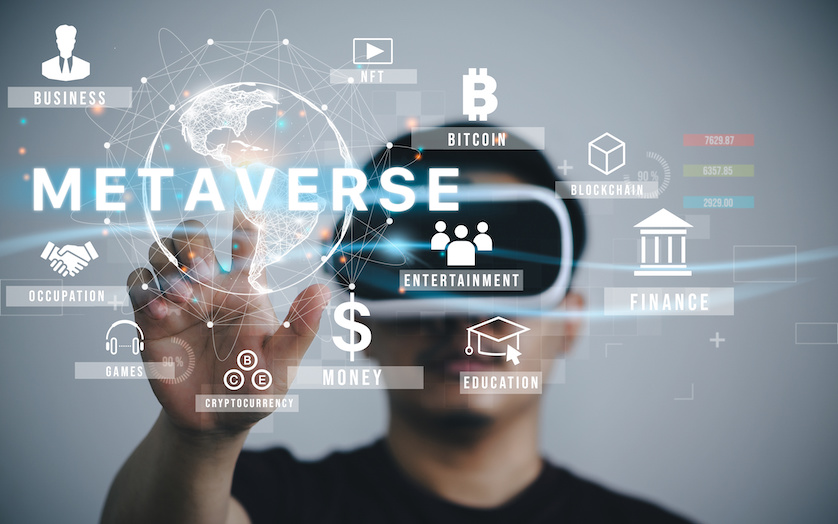

## What the future of XR/VR looks like?

Virtual reality (VR) and Extended/Mixed Reality (XR/MR) headset unit sales worldwide are increasing.

But what applications will be supported in the near future? Let's look at some insights:
- Janice Fernandes, YouGov, 2022, Global: Appetite for VR activities falling around the world – except for shopping, Accessed: October 2023. URL: [https://business.yougov.com/content/42775-global-appetite-vr-activities-falling-around-world](https://business.yougov.com/content/42775-global-appetite-vr-activities-falling-around-world)
- Workplace. Meta. 2023. The future of VR – top trends for 2023. Accessed: October 2023, URL: [https://en-gb.workplace.com/blog/the-future-of-vr](https://en-gb.workplace.com/blog/the-future-of-vr)

{alt="video"}

{alt="metaverse"}

The **Metaverse** is a term which is lately associated with
Virtual Reality and Virutal Worlds.

According to Steve Benford[^1] some properties of the 
metaverse include:

1. A virtual world + virtual reality.
2. Social experience.
3. Persistency.
4. Connection to the real world.

[^1]: Steve Benford. (2021) Metaverse: five things to know – and what it could mean for you. The Conversation. URL: [https://theconversation.com/metaverse-five-things-to-know-and-what-it-could-mean-for-you-171061](https://theconversation.com/metaverse-five-things-to-know-and-what-it-could-mean-for-you-171061)

It is likely developments of VR will focus on 
developing this visions, as business models
can be deployed in such a vision.

::::::::::::::::::::::::::::::::::::: keypoints 

- The metaverse is a future iteration of VR. 
- Metaverse is not only virtual, but also sociable and persitent.
- Allow for economic models to be used.

::::::::::::::::::::::::::::::::::::::::::::::::

