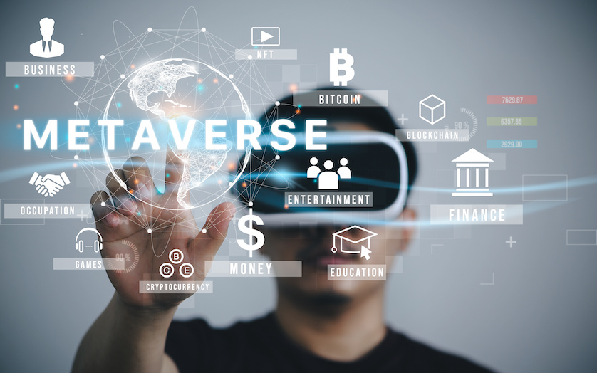

## What the future of XR/VR looks like?

If we look at the largest electronics show, for example, the
2024 Consumer Electronics Show (CES) where various consumer innovations were presented.

URL: https://www.ces.tech/topics/arvrxr/

### Examples of new headsets and glasses (2024):

- [Sony's Enterprise Mixed Reality Headset](https://www.sw.siemens.com/en-US/digital-transformation/sony-head-mounted-display-vr/)
- 
[XREAL Air 2 Ultra](https://uk.shop.xreal.com/products/xreal-air-2-ultra)
- [RayNeo X2 AI AR Glasses](https://www.rayneo.com/products/tcl-rayneo-x2) 
- [Vuzix](https://www.vuzix.com/) 

### Examples of new sensors  (2024):

- [Palmplug](https://www.palmplug.com/)
- [Arm bands](https://www.valkyrie-vr.com/)
- [Ultraleap Hand tracker](https://www.ultraleap.com/product/)

### Some examples of XR for clothes sales

{alt="video"}

## The Metaverse

{alt="metaverse"}

The **Metaverse** is a term which is lately associated with
Virtual Reality and Virtual Worlds.

According to Steve Benford[^1] some properties of the 
metaverse include:

1. A virtual world + virtual reality.
2. Social experience.
3. Persistency.
4. Connection to the real world.

[^1]: Steve Benford. (2021) Metaverse: five things to know – and what it could mean for you. The Conversation. URL: [https://theconversation.com/metaverse-five-things-to-know-and-what-it-could-mean-for-you-171061](https://theconversation.com/metaverse-five-things-to-know-and-what-it-could-mean-for-you-171061)

It is likely developments of VR will focus on developing this visions, as business models
can be deployed in such a vision.

### Additional links
- Workplace. Meta. 2023. The future of VR – top trends for 2023. Accessed: October 2023, URL: [https://en-gb.workplace.com/blog/the-future-of-vr](https://en-gb.workplace.com/blog/the-future-of-vr)

::::::::::::::::::::::::::::::::::::: keypoints 

- The Metaverse is a future iteration of VR. 
- Metaverse is not only virtual, but also sociable and persitent.
- Allow for economic models to be used.

::::::::::::::::::::::::::::::::::::::::::::::::

